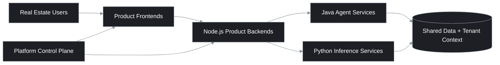
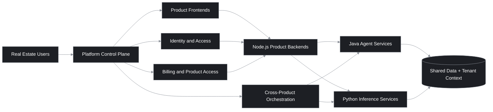
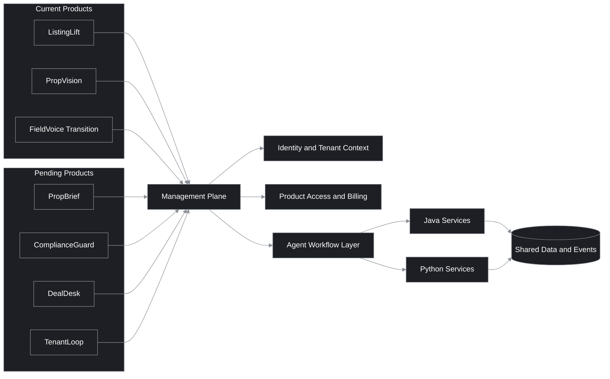

# AI Agent Platform for Real Estate

This project is a vertical AI integration for real estate teams. Instead of one generic AI tool, it delivers a connected set of products that share the same foundation for identity, tenancy, data, and agent orchestration.

All products in this platform are agentic products, designed around specialized workflow agents rather than generic chat-only interfaces.

This README is written for three audiences at once:

- business and investment stakeholders evaluating category and growth potential
- customers evaluating practical workflow value
- engineering teams evaluating architecture and implementation fit

## Table of Contents

- [What Problem We Are Solving](#what-problem-we-are-solving)
- [How The Workspace Connects](#how-the-workspace-connects)
- [Architecture Diagrams](#architecture-diagrams)
- [Agentic Workflow And Human Approval Model](#agentic-workflow-and-human-approval-model)
- [Platform Delivery Assets](#platform-delivery-assets)
- [What Has Been Completed](#what-has-been-completed)
- [Products We Offer](#products-we-offer)
- [Success Metrics To Track](#success-metrics-to-track)
- [Install After Clone](#install-after-clone)
- [Intent Of This README](#intent-of-this-readme)

## What Problem We Are Solving

Real estate teams often switch between disconnected tools for listings, photos, compliance, documents, and client communication. That creates duplicate work, inconsistent data, and slower response times.

This platform is built to solve that by:

- connecting multiple real estate AI products on one shared platform
- reusing common services (auth, tenant context, product access, integrations)
- running specialized agents for specific business workflows
- keeping product experiences separate while sharing backend capabilities

## How The Workspace Connects

Each folder is part of one end-to-end system:

- `ai-product-management/`: platform control plane for tenant-aware auth, product access, and shared operations
- `ai-listing-agent/`: ListingLift product workspace (frontend + backend)
- `services-java/`: Java Spring Boot agent workflow services (listing, CV, IDP, voice)
- `services-python/`: Python model/inference services (speech, vision, and agent support)
- `shared/`: shared contracts/types
- `ai-product-starter-template/`: internal starter template for new product modules that need the same baseline look, shell, and frontend/backend structure
- `docs/` and `plans/`: architecture, decisions, and migration planning



## Architecture Diagrams

The diagrams below show how current and pending products connect through one shared system.

### 1) End-To-End Platform Flow



### 2) Current And Pending Product Map



### 3) Request Lifecycle (Auth To Outcome)

```mermaid
%%{init: {'theme': 'base', 'themeVariables': { 'primaryTextColor': '#ffffff', 'secondaryTextColor': '#ffffff', 'tertiaryTextColor': '#ffffff', 'lineColor': '#8b9098', 'clusterBkg': '#1d1f24', 'clusterBorder': '#8b9098' }}}%%
flowchart LR
	U[User Request] --> AUTH[Identity and Session Check]
	AUTH --> ROUTE[Product Route and Tenant Context]
	ROUTE --> ORCH[Agent Workflow Orchestration]

	ORCH --> STEP1[Ingest and Classification]
	STEP1 --> STEP2[Agent Generation and Validation]
	STEP2 --> HITL[Human Review Gate]
	HITL --> STORE[Persist Result and Metadata]

	STORE --> BILL[Usage and Billing Event]
	STORE --> RESP[Product Response to User]

	BILL --> PMON[Platform Monitoring and Analytics]
	RESP --> PMON

	classDef platform fill:#1d1f24,stroke:#8b9098,color:#ffffff,stroke-width:1px;
	class U,AUTH,ROUTE,ORCH,STEP1,STEP2,HITL,STORE,BILL,RESP,PMON platform;
```



## Agentic Workflow And Human Approval Model

This platform uses agentic workflows where specialized agents execute defined steps in sequence with auditable inputs, outputs, and confidence signals.

### What Will Be Agentic Workflows

The following workflow types are designed to run as agentic pipelines:

- listing preparation workflows (ingest, classification, auto-fill, copy generation, compliance pre-check)
- vision workflows (photo attribute detection, quality checks, anomaly flags)
- voice workflows (lead intake, qualification, appointment coordination, disposition logging)
- document workflows (extraction, structuring, risk/compliance tagging)
- tenant and customer support workflows (triage, routing, guided responses, follow-up tasks)

### Why Agentic Workflows

Agentic delivery is used because it provides:

- clearer ownership of each workflow stage through specialized agents
- better reliability than one generic prompt flow by separating tasks by function
- stronger auditability through step-level traces, confidence, and decision logs
- safer automation by allowing targeted human review at policy and risk boundaries
- easier evolution by upgrading or replacing one agent without rewriting the whole workflow

### Human-In-The-Loop Requirements

Human review is required whenever automation confidence is low or business risk is high. Typical triggers include:

- confidence below product-defined thresholds
- compliance, legal, fair-housing, or policy-sensitive output
- financial, contractual, or customer-impacting actions
- cross-system conflicts or ambiguous source data
- customer escalation, dispute, or exception handling

### Multi-Level Human Approvals (When Needed)

Approval levels are risk-based and can be configured per tenant or product:

| Level | Reviewer | Typical Scope | Result |
|---|---|---|---|
| Level 1 | Operator or agent user | routine low-risk edits and validation | approve, request regeneration, or escalate |
| Level 2 | Team lead or compliance reviewer | medium-risk compliance or quality-sensitive outputs | approve with notes, reject, or escalate |
| Level 3 | Manager, legal, or admin approver | high-risk, legal, contractual, publishing, or external-release actions | final approve or hard reject |

Not every workflow requires all levels. The default model is minimum necessary approval with mandatory escalation for high-risk decisions.

## Platform Delivery Assets

Not every workspace module is customer-facing. Some exist to speed up delivery and keep implementation consistent across products.

- `ai-product-starter-template/`: internal starter project for launching a new product module with the shared platform shell, React + Vite frontend, Node.js + Express backend, shared TypeScript contracts, and placeholder service integration wiring

This template is used to start new products faster while preserving the same structural conventions and baseline visual language across the portfolio.

## What Has Been Completed

This section highlights delivered progress that matters to all three audiences:

- customers: faster, more reliable workflow outcomes in one platform
- investors: clear execution from concept to integrated product architecture
- developers: a working, multi-service foundation with proven integration patterns

The platform has already moved from early assistant experiments into a vertical, agentic real-estate AI system with production-oriented foundations.

This platform direction is based on lessons from earlier assistant implementations, and the current plan is to add skills to each agent tool to make the overall solution more complete and consistent.

### Evolution Summary

The execution path has been deliberate and measurable:

- phase 1: generative AI chat and voice VA capabilities were implemented first as shared assistant foundations
- phase 2: horizontal integration established shared services and reusable platform capabilities
- phase 3: vertical integration shifted delivery to real-estate-specific workflows and product boundaries
- phase 4: agentic transition now centers delivery around specialized workflow agents per product

### Scope Repurposing (Delivered Direction)

To align platform value with user needs and product focus:

- chat is being repurposed into a site AI assistant for AI Services Platform guidance and customer support journeys
- voice is being repurposed into a dedicated FieldVoice agent workflow product for field and lead-handling operations

### Delivered Technology Highlights

The following capabilities are implemented and already operating across the workspace:

- platform and product frontends using React, Vite, and TypeScript
- API and business-service layer using Node.js and Express with TypeScript
- agent workflow orchestration services using Java Spring Boot
- model and inference support services using Python service patterns
- tenant-aware authentication and session integration using OAuth and Keycloak
- operational data and caching foundations using MongoDB and Redis
- multi-repo workspace automation for install, bootstrap, and environment setup
- integrated management-plane to product-module to service-layer connectivity

### Milestone Snapshot

#### ai-listing-agent completed milestones

- completed standalone product workspace setup with frontend and backend structure
- completed listing workflow UI modernization and reliability hardening for core user journeys
- completed phase-1 login modernization plus shell, header, and sidebar UX improvements
- completed environment and setup documentation for faster onboarding and repeatable local startup
- completed branding and product narrative refresh for clearer external positioning

#### ai-product-management completed milestones

- completed standalone extraction and shared-auth integration for independent operation
- completed migration cleanup and documentation normalization under ai-product-management ownership
- completed broad UI modernization across shell, high-traffic pages, and utility screens
- completed subscriptions, payments, and admin dashboard refinements with responsive card and grid behavior
- completed management-plane rebrand documentation aligned to Infero Agents positioning

#### ai-product-starter-template completed milestones

- completed standalone starter workspace with frontend, backend-node, and shared package structure
- completed reusable shell, navigation, and base page scaffolding for new product modules
- completed starter backend routes for health checks, example API responses, and mock Java integration wiring
- completed template documentation for setup, reuse guidance, and AI-assisted product bootstrapping prompts

### Recent Delivery Timeline

Recent commits show continued execution momentum and architectural consistency.

#### ai-listing-agent recent delivered changes

- `534f915`: docs update for README branding and homepage preview
- `3e53bba`: shell header identity and sidebar UX polish
- `5b10768`: listing workflow UI modernization and reliability improvements
- `ea88618`: phase-1 login experience modernization
- `55ec403`: default tenant bootstrap login fix

#### ai-product-management recent delivered changes

- `1e641fd`: subscriptions, payments, and admin dashboard UI refinement
- `0a1a3ed`: broad ai-product-management UI system modernization
- `a46bbeb`: README rebrand to Infero Agents management plane
- `6a71a96`: README rewrite with FieldVoice migration framing
- `f4a75fc`: ListingLift integration as subscription-gated platform product

## Products We Offer

The platform is built as a connected product suite for real estate operations. Each product solves a focused workflow, and together they create a full vertical AI stack.

- ListingLift: turns property inputs and photos into listing-ready content faster.
- PropVision: analyzes property images to identify features and improve listing quality.
- PropBrief: generates concise market and property intelligence summaries for faster decision-making.
- ComplianceGuard: reviews content for policy and compliance risks before publishing.
- DealDesk: extracts and structures information from real estate documents.
- FieldVoice: manages voice-based lead intake, qualification, and follow-up workflows.
- TenantLoop: supports tenant and property management workflows with AI assistance.

Product availability can vary by rollout phase. Some modules are active now, and others are transitional or planned as architecture migration continues.

## Success Metrics To Track

Use these as practical product and platform metrics while rolling out the new architecture:

| Metric | Why It Matters | How To Measure |
|---|---|---|
| Time to first draft listing | Measures ListingLift value for agents | Median minutes from upload to draft |
| Human edit rate after generation | Measures output quality | % of generated content requiring major edits |
| Compliance pass rate (first review) | Measures compliance quality | % passing first review gate |
| Lead response time (FieldVoice) | Measures customer experience speed | Median time from inbound call to logged outcome |
| Cross-product adoption per tenant | Measures platform integration value | # of products actively used per tenant/month |
| Platform uptime for core workflows | Measures operational reliability | Availability for login + core product APIs |

## Install After Clone

Use the workspace installer script as the source of truth for setup.

1. Clone and enter the repository.

```bash
git clone <your-repo-url>
cd ai-services-platform
```

2. Run the installer script (PowerShell).

```powershell
./scripts/install-workspace.ps1
```

Optional: if your repositories are under a different GitHub owner, pass it explicitly.

```powershell
./scripts/install-workspace.ps1 -GitHubOwner <your-github-owner>
```

What this script does:

- clones missing sibling repos in this workspace (`ai-listing-agent`, `ai-product-management`, `ai-product-starter-template`, `services-java`, `services-python`, `shared`)
- creates missing `.env` files from `.env.example` templates (with prompt/confirmation)
- installs Java dependencies using Maven wrapper offline dependency fetch
- installs Node.js dependencies for active modules (`npm ci` when lockfile exists, otherwise `npm install`)
- prints infrastructure startup commands for Docker and Podman

The installer also prepares template environment files and dependencies for `ai-product-starter-template` when present or cloned.

3. Start infrastructure with one of the compose files printed by the installer.

```bash
docker compose -f infra/docker-compose.dev.yml up -d
```

or

```bash
podman-compose -f infra/podman-compose.dev.yml up -d
```

4. Start application services.

- Windows: `./start-app.ps1`
- macOS/Linux: `./start-app.sh`

## Intent Of This README

This README stays concise and user-focused: what this platform is, what business problem it solves, how modules connect, and how to get running after clone.

Service-level behavior and deep technical details belong in each module README and the docs folder.
