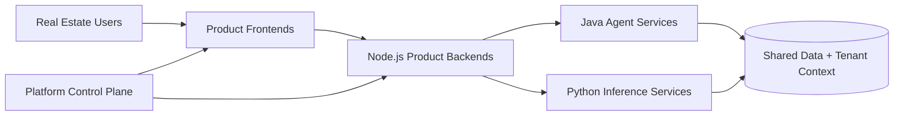

# AI Agent Platform for Real Estate

Note: this is a documentation name update only. The repository name will be changed later.

Work in progress: this README is actively being updated and will evolve as architecture and product documentation are refined.

This project is a vertical AI integration for real estate teams. Instead of one generic AI tool, it delivers a connected set of products that share the same foundation for identity, tenancy, data, and agent orchestration.

All products in this platform are agentic products, designed around specialized workflow agents rather than generic chat-only interfaces.

This README is written for three audiences at once:

- business and investment stakeholders evaluating category and growth potential
- customers evaluating practical workflow value
- engineering teams evaluating architecture and implementation fit

## Table of Contents

- [What Problem We Are Solving](#what-problem-we-are-solving)
- [How The Workspace Connects](#how-the-workspace-connects)
- [What Has Been Completed](#what-has-been-completed)
- [Products We Offer](#products-we-offer)
- [Success Metrics To Track](#success-metrics-to-track)
- [Install After Clone](#install-after-clone)
- [Intent Of This README](#intent-of-this-readme)

## What Problem We Are Solving

Real estate teams often switch between disconnected tools for listings, photos, compliance, documents, and client communication. That creates duplicate work, inconsistent data, and slower response times.

This platform is built to solve that by:

- connecting multiple real estate AI products on one shared platform
- reusing common services (auth, tenant context, product access, integrations)
- running specialized agents for specific business workflows
- keeping product experiences separate while sharing backend capabilities

## How The Workspace Connects

Each folder is part of one end-to-end system:

- `product-management/`: platform control plane for tenant-aware auth, product access, and shared operations
- `ai-listing-agent/`: ListingLift product workspace (frontend + backend)
- `services-java/`: Java Spring Boot agent workflow services (listing, CV, IDP, voice)
- `services-python/`: Python model/inference services (speech, vision, and agent support)
- `shared/`: shared contracts/types
- `ai-product-template/`: starter template for new product modules
- `docs/` and `plans/`: architecture, decisions, and migration planning



## What Has Been Completed

This section is focused on what is already delivered in the two core product workspaces: `ai-listing-agent` and `product-management`.

### Milestone Snapshot

#### ai-listing-agent completed milestones

- completed standalone product workspace setup with frontend and backend structure
- completed ListingLift README, setup flow, and environment documentation
- completed phase-1 login modernization and shell/header/sidebar UX upgrades
- completed listing workflow UI modernization and service reliability hardening
- completed branding and documentation refresh with homepage preview and updated product narrative

#### product-management completed milestones

- completed standalone extraction and shared-auth integration work for independent operation
- completed migration cleanup and documentation normalization for product-management ownership
- completed broad UI modernization across shell, pages, and utility surfaces
- completed subscriptions, payments, and admin dashboard refinement with responsive card and grid updates
- completed management plane rebrand documentation for Infero Agents positioning

### Recent Delivery Timeline

#### ai-listing-agent recent delivered changes

- `534f915`: docs update for README branding and homepage preview
- `3e53bba`: shell header identity and sidebar UX polish
- `5b10768`: listing workflow UI modernization and reliability improvements
- `ea88618`: phase-1 login experience modernization
- `55ec403`: default tenant bootstrap login fix

#### product-management recent delivered changes

- `1e641fd`: subscriptions, payments, and admin dashboard UI refinement
- `0a1a3ed`: broad product-management UI system modernization
- `a46bbeb`: README rebrand to Infero Agents management plane
- `6a71a96`: README rewrite with FieldVoice migration framing
- `f4a75fc`: ListingLift integration as subscription-gated platform product

## Products We Offer

The platform is built as a connected product suite for real estate operations. Each product solves a focused workflow, and together they create a full vertical AI stack.

- ListingLift: turns property inputs and photos into listing-ready content faster.
- PropVision: analyzes property images to identify features and improve listing quality.
- PropBrief: generates concise market and property intelligence summaries for faster decision-making.
- ComplianceGuard: reviews content for policy and compliance risks before publishing.
- DealDesk: extracts and structures information from real estate documents.
- FieldVoice: manages voice-based lead intake, qualification, and follow-up workflows.
- TenantLoop: supports tenant and property management workflows with AI assistance.

Product availability can vary by rollout phase. Some modules are active now, and others are transitional or planned as architecture migration continues.

## Success Metrics To Track

Use these as practical product and platform metrics while rolling out the new architecture:

| Metric | Why It Matters | How To Measure |
|---|---|---|
| Time to first draft listing | Measures ListingLift value for agents | Median minutes from upload to draft |
| Human edit rate after generation | Measures output quality | % of generated content requiring major edits |
| Compliance pass rate (first review) | Measures compliance quality | % passing first review gate |
| Lead response time (FieldVoice) | Measures customer experience speed | Median time from inbound call to logged outcome |
| Cross-product adoption per tenant | Measures platform integration value | # of products actively used per tenant/month |
| Platform uptime for core workflows | Measures operational reliability | Availability for login + core product APIs |

## Install After Clone

Use the workspace installer script as the source of truth for setup.

1. Clone and enter the repository.

```bash
git clone <your-repo-url>
cd ai-services-platform
```

2. Run the installer script (PowerShell).

```powershell
./scripts/install-workspace.ps1
```

Optional: if your repositories are under a different GitHub owner, pass it explicitly.

```powershell
./scripts/install-workspace.ps1 -GitHubOwner <your-github-owner>
```

What this script does:

- clones missing sibling repos in this workspace (`ai-listing-agent`, `services-java`, `services-python`, `product-management`, `shared`)
- creates missing `.env` files from `.env.example` templates (with prompt/confirmation)
- installs Java dependencies using Maven wrapper offline dependency fetch
- installs Node.js dependencies for active modules (`npm ci` when lockfile exists, otherwise `npm install`)
- prints infrastructure startup commands for Docker and Podman

3. Start infrastructure with one of the compose files printed by the installer.

```bash
docker compose -f infra/docker-compose.dev.yml up -d
```

or

```bash
podman-compose -f infra/podman-compose.dev.yml up -d
```

4. Start application services.

- Windows: `./start-app.ps1`
- macOS/Linux: `./start-app.sh`

## Intent Of This README

This README stays concise and user-focused: what this platform is, what business problem it solves, how modules connect, and how to get running after clone.

Service-level behavior and deep technical details belong in each module README and the docs folder.