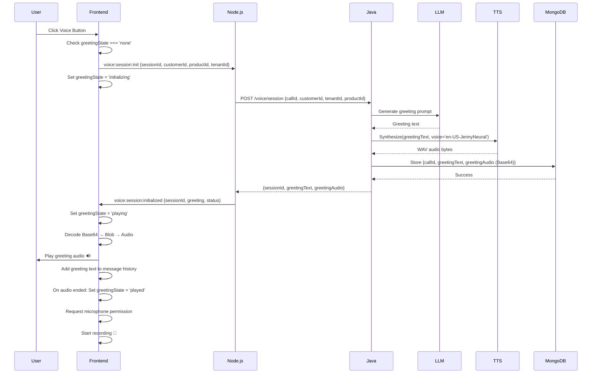
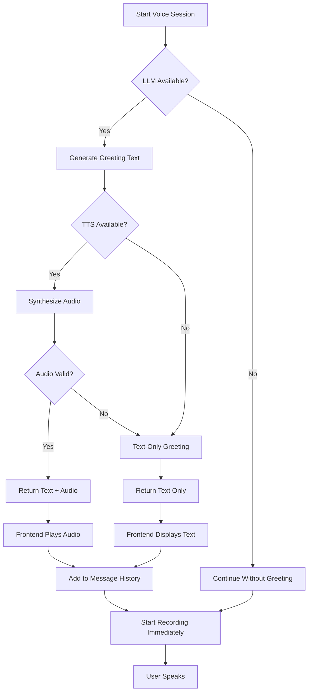

# Voice Greeting Implementation Guide

## Overview

This document describes the implementation of initial LLM-generated greetings for voice chat sessions in the AI Services Platform. The greeting system provides a personalized, AI-generated welcome message with text-to-speech synthesis when users start a voice conversation.

**Last Updated:** 2025-01-28  
**Version:** 1.0  
**Author:** AI Services Platform Team

---

## Table of Contents

1. [Architecture Overview](#architecture-overview)
2. [Components](#components)
3. [Data Flow](#data-flow)
4. [Frontend Implementation](#frontend-implementation)
5. [Backend Implementation](#backend-implementation)
6. [Java Service Integration](#java-service-integration)
7. [Testing Guide](#testing-guide)
8. [Troubleshooting](#troubleshooting)
9. [Future Enhancements](#future-enhancements)

---

## Architecture Overview

### High-Level Architecture

```
┌─────────────┐         ┌──────────────┐         ┌──────────────┐
│   React     │◄───────►│   Node.js    │◄───────►│     Java     │
│  Frontend   │ Socket  │   Backend    │  gRPC   │   Backend    │
│             │  .IO    │              │         │              │
└─────────────┘         └──────────────┘         └──────────────┘
      │                       │                         │
      │ 1. voice:session:init │                         │
      ├──────────────────────►│                         │
      │                       │ 2. startVoiceSession    │
      │                       ├────────────────────────►│
      │                       │                         │
      │                       │                    3. LLM+TTS
      │                       │                         │
      │                       │ 4. greetingText+Audio   │
      │                       │◄────────────────────────┤
      │ 5. voice:session:init │                         │
      │    :initialized       │                         │
      │◄──────────────────────┤                         │
      │                       │                         │
 6. Play greeting audio       │                         │
      │                       │                         │
 7. Start microphone          │                         │
```

### System Components

| Component | Technology | Responsibility |
|-----------|-----------|----------------|
| Frontend Client | React + TypeScript + Socket.IO | Voice UI, greeting playback, user interaction |
| Node.js Backend | Express + Socket.IO | WebSocket proxy, event routing |
| Java Backend | Spring Boot + gRPC | LLM integration, TTS synthesis, greeting generation |
| MongoDB | NoSQL Database | Session data, greeting storage (temporary) |
| LM Studio | Local LLM | Greeting text generation |
| Azure TTS | Cloud TTS Service | Audio synthesis (fallback to local) |

---

## Components

### 1. Frontend Components

#### **AssistantChat Component** (`frontend/src/components/AssistantChat.tsx`)

**State Management:**
```typescript
// Greeting-specific state
const [greetingState, setGreetingState] = useState<'none' | 'initializing' | 'playing' | 'played'>('none');
const [greetingAudio, setGreetingAudio] = useState<string | null>(null);
const [greetingText, setGreetingText] = useState<string | null>(null);

// Audio refs
const greetingAudioRef = useRef<HTMLAudioElement>(null);
```

**Key Functions:**

1. **`initializeVoiceSession()`**
   - Emits `voice:session:init` event to backend
   - Waits for `voice:session:initialized` response (10s timeout)
   - Sets greeting state to `'initializing'`
   - Returns: `Promise<boolean>` (success/failure)

2. **`playGreetingAudio(audioBase64: string)`**
   - Decodes Base64 audio to binary
   - Creates Blob and audio URL
   - Plays using `greetingAudioRef`
   - Sets greeting state to `'playing'`
   - Returns: `Promise<void>` (resolves when playback ends)

3. **`startVoiceRecording()`**
   - Checks if greeting needed (`greetingState === 'none'`)
   - Calls `initializeVoiceSession()` if needed
   - Plays greeting if available
   - Adds greeting text to message history
   - Requests microphone permission
   - Starts audio recording

**UI States:**

| State | Description | UI Indicator | Button State |
|-------|-------------|--------------|--------------|
| `none` | No greeting initialized | None | Enabled (green) |
| `initializing` | Fetching greeting from backend | ⏳ "Preparing voice assistant..." | Disabled (amber) |
| `playing` | Playing greeting audio | 👋 "Playing greeting..." | Disabled (amber) |
| `played` | Greeting completed | None | Enabled (green) |

---

### 2. Backend Components

#### **Voice Socket Handler** (`backend-node/src/sockets/voice-socket.ts`)

**Event: `voice:session:init`**

```typescript
socket.on('voice:session:init', async (data: VoiceSessionInitEventData) => {
  const { sessionId, customerId, productId, tenantId } = data;
  
  // Call Java REST endpoint
  const response = await grpcClient.startVoiceSessionWithGreeting({
    callId: sessionId,
    customerId,
    tenantId,
    productId
  });
  
  // Prepare greeting object
  const greeting: VoiceGreeting | null = response.greetingText && response.greetingAudio
    ? { text: response.greetingText, audio: response.greetingAudio }
    : null;
  
  // Emit response
  socket.emit('voice:session:initialized', {
    sessionId: response.sessionId,
    greeting,
    status: greeting ? 'ready' : 'ready_no_greeting'
  });
});
```

**Data Types:**

```typescript
interface VoiceSessionInitEventData {
  sessionId: string;
  customerId: string;
  productId?: string;
  tenantId?: string;
}

interface VoiceSessionInitializedEvent {
  sessionId: string;
  greeting: VoiceGreeting | null;
  status: 'ready' | 'ready_no_greeting';
}

interface VoiceGreeting {
  text: string;
  audio: string; // Base64-encoded WAV
}
```

---

### 3. Java Service Components

#### **REST Endpoint** (`services-java/voice-service/src/main/java/com/infero/voice/controller/VoiceController.java`)

**Endpoint: `POST /voice/session`**

```java
@PostMapping("/session")
public ResponseEntity<VoiceSessionResponse> initializeVoiceSession(@RequestBody VoiceSessionRequest request) {
    try {
        // Generate greeting text with LLM
        String greetingText = llmService.generateGreeting(request.getTenantId(), request.getProductId());
        
        // Synthesize to audio with TTS
        byte[] greetingAudio = ttsService.synthesize(greetingText, "en-US-JennyNeural");
        
        // Store in MongoDB
        assistantCallRepository.save(new AssistantCall(
            request.getCallId(),
            greetingText,
            Base64.getEncoder().encodeToString(greetingAudio)
        ));
        
        return ResponseEntity.ok(new VoiceSessionResponse(
            request.getCallId(),
            greetingText,
            Base64.getEncoder().encodeToString(greetingAudio)
        ));
    } catch (Exception e) {
        // Return without greeting on error (non-blocking)
        return ResponseEntity.ok(new VoiceSessionResponse(request.getCallId(), null, null));
    }
}
```

---

## Data Flow

### Voice Session Initialization Sequence



### Error Handling Flow



---

## Frontend Implementation

### Voice Button Component

```tsx
<button
  onClick={toggleVoiceRecording}
  disabled={!sessionId || isLoading || greetingState === 'initializing' || greetingState === 'playing'}
  title={
    !sessionId ? 'Chat session not initialized' :
    isLoading ? 'Processing previous message...' :
    greetingState === 'initializing' ? 'Initializing voice session...' :
    greetingState === 'playing' ? 'Playing greeting...' :
    isRecording ? 'Stop recording' : 'Start voice recording'
  }
  style={{
    backgroundColor: 
      greetingState === 'initializing' || greetingState === 'playing' ? '#f59e0b' :
      isRecording ? '#ef4444' : '#10b981',
    cursor: (!sessionId || isLoading || greetingState === 'initializing' || greetingState === 'playing') 
      ? 'not-allowed' : 'pointer',
    opacity: (!sessionId || isLoading || greetingState === 'initializing' || greetingState === 'playing') 
      ? 0.5 : 1
  }}
>
  {/* Icon changes based on state */}
</button>
```

### Greeting Status Indicators

```tsx
{(voiceStatus !== 'idle' || greetingState === 'initializing' || greetingState === 'playing') && (
  <div style={{ backgroundColor: greetingState === 'initializing' ? '#fef3c7' : greetingState === 'playing' ? '#d1fae5' : ... }}>
    {greetingState === 'initializing' && (
      <>
        <span>⏳</span>
        <span>Preparing voice assistant...</span>
        <span>Generating personalized greeting</span>
      </>
    )}
    
    {greetingState === 'playing' && (
      <>
        <span>👋</span>
        <span>Playing greeting...</span>
        <button onClick={skipGreeting}>Skip</button>
      </>
    )}
  </div>
)}
```

### Audio Playback Implementation

```typescript
const playGreetingAudio = async (audioBase64: string): Promise<void> => {
  return new Promise((resolve, reject) => {
    try {
      setGreetingState('playing');
      setVoiceStatus('speaking');

      // Decode Base64 → Binary → Blob
      const binaryString = atob(audioBase64);
      const bytes = new Uint8Array(binaryString.length);
      for (let i = 0; i < binaryString.length; i++) {
        bytes[i] = binaryString.charCodeAt(i);
      }
      const blob = new Blob([bytes], { type: 'audio/wav' });
      const audioUrl = URL.createObjectURL(blob);

      // Play audio
      if (greetingAudioRef.current) {
        greetingAudioRef.current.src = audioUrl;
        
        greetingAudioRef.current.onended = () => {
          setGreetingState('played');
          setVoiceStatus('idle');
          URL.revokeObjectURL(audioUrl);
          resolve();
        };
        
        greetingAudioRef.current.onerror = (err) => {
          setGreetingState('played'); // Continue anyway
          setVoiceStatus('idle');
          URL.revokeObjectURL(audioUrl);
          reject(err);
        };
        
        greetingAudioRef.current.play().catch(reject);
      }
    } catch (error) {
      setGreetingState('played');
      setVoiceStatus('idle');
      reject(error);
    }
  });
};
```

---

## Backend Implementation

### Node.js Socket.IO Handler

**File:** `backend-node/src/sockets/voice-socket.ts`

```typescript
export function setupVoiceHandlers(socket: AuthenticatedSocket): void {
  socket.on('voice:session:init', async (data: VoiceSessionInitEventData) => {
    const { sessionId, customerId, productId, tenantId } = data;
    
    try {
      // Call Java REST endpoint
      const response = await grpcClient.startVoiceSessionWithGreeting({
        callId: sessionId,
        customerId,
        tenantId: tenantId || socket.user?.tenantId || customerId,
        productId: productId || 'va-service'
      });
      
      // Join voice room
      socket.join(`voice:${sessionId}`);
      
      // Prepare greeting
      let greeting: VoiceGreeting | null = null;
      if (response.greetingText && response.greetingAudio) {
        greeting = {
          text: response.greetingText,
          audio: response.greetingAudio
        };
      }
      
      // Emit response
      socket.emit('voice:session:initialized', {
        sessionId: response.sessionId,
        greeting,
        status: greeting ? 'ready' : 'ready_no_greeting'
      });
      
    } catch (error: any) {
      socket.emit('voice:session:init:error', {
        error: 'Session initialization failed',
        details: error.message
      });
    }
  });
}
```

### gRPC Client Method

**File:** `backend-node/src/grpc/client.ts`

```typescript
async startVoiceSessionWithGreeting(request: VoiceSessionInitRequest): Promise<VoiceSessionInitResponse> {
  try {
    // Make REST call to Java service
    const response = await axios.post<VoiceSessionInitResponse>(
      `${this.javaServiceUrl}/voice/session`,
      request,
      {
        timeout: 10000, // 10 second timeout
        headers: { 'Content-Type': 'application/json' }
      }
    );
    
    return response.data;
  } catch (error: any) {
    console.error('[gRPC] startVoiceSessionWithGreeting error:', error.message);
    
    // Return empty response on error (non-blocking)
    return {
      sessionId: request.callId,
      greetingText: null,
      greetingAudio: null
    };
  }
}
```

---

## Java Service Integration

### REST Controller

**File:** `services-java/voice-service/.../VoiceController.java`

```java
@RestController
@RequestMapping("/voice")
public class VoiceController {
    
    @Autowired
    private LLMService llmService;
    
    @Autowired
    private TTSService ttsService;
    
    @Autowired
    private AssistantCallRepository assistantCallRepository;
    
    @PostMapping("/session")
    public ResponseEntity<VoiceSessionResponse> initializeVoiceSession(@RequestBody VoiceSessionRequest request) {
        String callId = request.getCallId();
        
        try {
            // 1. Generate greeting with LLM
            String greetingText = llmService.generateGreeting(
                request.getTenantId(),
                request.getProductId()
            );
            
            // 2. Synthesize audio with TTS
            byte[] greetingAudio = ttsService.synthesize(
                greetingText,
                "en-US-JennyNeural",
                "audio/wav"
            );
            
            // 3. Store in MongoDB
            AssistantCall call = new AssistantCall();
            call.setCallId(callId);
            call.setGreetingText(greetingText);
            call.setGreetingAudio(Base64.getEncoder().encodeToString(greetingAudio));
            assistantCallRepository.save(call);
            
            // 4. Return response
            return ResponseEntity.ok(new VoiceSessionResponse(
                callId,
                greetingText,
                Base64.getEncoder().encodeToString(greetingAudio)
            ));
            
        } catch (Exception e) {
            log.error("Failed to generate greeting for callId={}: {}", callId, e.getMessage());
            
            // Return without greeting (non-blocking)
            return ResponseEntity.ok(new VoiceSessionResponse(callId, null, null));
        }
    }
}
```

### LLM Service

```java
@Service
public class LLMService {
    
    public String generateGreeting(String tenantId, String productId) throws Exception {
        // Build prompt
        String prompt = String.format(
            "Generate a friendly, professional greeting for a voice assistant conversation. " +
            "Keep it concise (1-2 sentences). Tenant: %s, Product: %s",
            tenantId, productId
        );
        
        // Call LM Studio
        LLMRequest request = new LLMRequest(prompt, 0.7, 100);
        LLMResponse response = restTemplate.postForObject(
            lmStudioUrl + "/v1/completions",
            request,
            LLMResponse.class
        );
        
        return response.getChoices().get(0).getText().trim();
    }
}
```

### TTS Service

```java
@Service
public class TTSService {
    
    public byte[] synthesize(String text, String voiceName, String format) throws Exception {
        // Try Azure TTS first
        try {
            return azureTTS.synthesize(text, voiceName);
        } catch (Exception e) {
            log.warn("Azure TTS failed, falling back to local TTS");
            return localTTS.synthesize(text, voiceName);
        }
    }
}
```

---

## Testing Guide

### Manual Testing Checklist

#### **1. Happy Path Test**

1. Open frontend: `http://localhost:5173`
2. Navigate to Voice Demo page
3. Click green microphone button
4. **Expected:**
   - Button turns amber (initializing)
   - Status shows: "⏳ Preparing voice assistant..."
   - Wait 2-5 seconds
   - Status shows: "👋 Playing greeting..."
   - Hear audio greeting
   - Greeting text appears in message history
   - Button turns green (ready)
   - Microphone activates
5. Speak into microphone
6. Click button to stop recording

#### **2. Error Scenarios**

| Scenario | Test Steps | Expected Behavior |
|----------|-----------|-------------------|
| LLM Unavailable | Stop LM Studio, click voice button | Continue without greeting, mic starts immediately |
| TTS Failure | Disconnect internet (Azure TTS fails) | Show text greeting only, no audio plays |
| Network Timeout | Add 15s delay in Java service | Frontend timeout after 10s, continues without greeting |
| Invalid Audio Format | Return corrupted Base64 | Log error, skip greeting, continue |
| Greeting Already Played | Click voice button twice | Second click skips greeting initialization |

### Automated Testing

**Frontend Unit Tests** (`AssistantChat.test.tsx`):

```typescript
describe('Voice Greeting', () => {
  it('should initialize voice session on first recording', async () => {
    const { getByTitle } = render(<AssistantChat useWebSocket={true} />);
    const voiceButton = getByTitle('Start voice recording');
    
    fireEvent.click(voiceButton);
    
    await waitFor(() => {
      expect(mockSocket.emit).toHaveBeenCalledWith('voice:session:init', expect.objectContaining({
        sessionId: expect.any(String),
        customerId: expect.any(String)
      }));
    });
  });
  
  it('should play greeting audio when received', async () => {
    const mockAudio = 'base64audiodata...';
    const mockGreeting = { text: 'Hello!', audio: mockAudio };
    
    mockSocket.emit('voice:session:initialized', {
      sessionId: 'test-session',
      greeting: mockGreeting,
      status: 'ready'
    });
    
    await waitFor(() => {
      expect(screen.getByText('Playing greeting...')).toBeInTheDocument();
    });
  });
});
```

**Backend Integration Tests** (`voice-socket.test.ts`):

```typescript
describe('Voice Session Initialization', () => {
  it('should return greeting on successful initialization', async () => {
    const client = io('http://localhost:3001', { auth: { token: testToken } });
    
    client.emit('voice:session:init', {
      sessionId: 'test-123',
      customerId: 'customer-1',
      productId: 'va-service'
    });
    
    const response = await new Promise(resolve => {
      client.once('voice:session:initialized', resolve);
    });
    
    expect(response).toMatchObject({
      sessionId: 'test-123',
      greeting: {
        text: expect.any(String),
        audio: expect.any(String)
      },
      status: 'ready'
    });
  });
});
```

---

## Troubleshooting

### Common Issues

#### **Issue 1: Greeting Not Playing**

**Symptoms:**
- Voice button works but no greeting plays
- Console shows: "No greeting audio received"

**Diagnosis:**
```bash
# Check Java service logs
tail -f services-java/voice-service/logs/application.log | grep "greeting"

# Check Node.js logs
# Look for: [Voice] Session initialized: { hasGreeting: false }
```

**Solutions:**
1. **LLM Not Running:**
   ```bash
   # Start LM Studio on port 1234
   curl http://localhost:1234/v1/models
   ```

2. **TTS Service Down:**
   ```bash
   # Check Azure TTS credentials
   echo $AZURE_SPEECH_KEY
   echo $AZURE_SPEECH_REGION
   ```

3. **MongoDB Connection:**
   ```bash
   # Verify MongoDB running
   mongosh --eval "db.adminCommand('ping')"
   ```

---

#### **Issue 2: Frontend Stuck on "Initializing..."**

**Symptoms:**
- Button stays amber forever
- Status: "⏳ Preparing voice assistant..." never changes

**Diagnosis:**
```javascript
// Open browser DevTools → Console
// Look for: [Voice] Session initialization timeout after 10 seconds
```

**Solutions:**
1. **Check WebSocket Connection:**
   ```javascript
   // In browser console:
   console.log(window.socket.connected); // Should be true
   ```

2. **Verify Backend Running:**
   ```bash
   curl http://localhost:3001/health
   ```

3. **Check Java Service:**
   ```bash
   curl http://localhost:8136/actuator/health
   ```

4. **Increase Timeout (temporary):**
   ```typescript
   // In AssistantChat.tsx
   const timeout = setTimeout(() => { ... }, 30000); // 30 seconds
   ```

---

#### **Issue 3: Audio Playback Error**

**Symptoms:**
- Greeting text shows but no audio
- Console error: "Failed to play greeting audio"

**Diagnosis:**
```javascript
// Check audio format
const audioBlob = base64ToBlob(greetingAudio, 'audio/wav');
console.log('Blob size:', audioBlob.size);
console.log('Blob type:', audioBlob.type);
```

**Solutions:**
1. **Invalid Base64:**
   ```typescript
   // Validate Base64 format
   const isValidBase64 = /^[A-Za-z0-9+/]*={0,2}$/.test(audioBase64);
   ```

2. **Browser Autoplay Policy:**
   ```typescript
   // Require user interaction before audio
   greetingAudioRef.current.play().catch(err => {
     if (err.name === 'NotAllowedError') {
       // Show "Click to play greeting" button
     }
   });
   ```

3. **Audio Format Mismatch:**
   ```java
   // Java: Ensure WAV format
   ttsService.synthesize(text, voiceName, "audio/wav");
   ```

---

#### **Issue 4: Greeting Plays Every Time**

**Symptoms:**
- Greeting repeats on every voice button click
- Should only play once per session

**Diagnosis:**
```typescript
// Check greeting state
console.log('Greeting state:', greetingState); // Should be 'played' after first play
```

**Solutions:**
1. **State Not Persisting:**
   ```typescript
   // Verify greeting state is not reset
   useEffect(() => {
     // Don't reset greetingState here
   }, [sessionId]);
   ```

2. **Multiple Session Inits:**
   ```typescript
   // Add guard in startVoiceRecording
   if (greetingState === 'none') {
     await initializeVoiceSession();
   }
   ```

---

### Debug Logging

**Enable Verbose Logging:**

**Frontend:**
```typescript
// In AssistantChat.tsx
const DEBUG_VOICE = true;

if (DEBUG_VOICE) {
  console.log('[Voice Debug]', {
    greetingState,
    greetingAudio: greetingAudio?.substring(0, 50),
    voiceStatus,
    sessionId
  });
}
```

**Backend:**
```typescript
// In voice-socket.ts
console.log('[Voice] 🎬 Initializing:', {
  sessionId,
  customerId,
  productId,
  tenantId,
  timestamp: new Date().toISOString()
});
```

**Java:**
```java
// In VoiceController.java
log.debug("Generating greeting: callId={}, tenantId={}, productId={}", 
    callId, tenantId, productId);
```

---

## Future Enhancements

### Phase 4: Advanced Features

1. **Personalized Greetings**
   - Use customer name from profile
   - Contextualize based on previous conversations
   - Time-of-day greetings ("Good morning", "Good evening")

2. **Multi-Language Support**
   - Detect user's preferred language
   - Generate greeting in user's language
   - Use language-specific TTS voices

3. **Voice Selection**
   - Let users choose preferred voice (male/female, accent)
   - Store preference in user profile
   - Apply to all TTS responses

4. **Greeting Caching**
   - Cache common greetings by tenant/product
   - Reduce LLM calls for repeat scenarios
   - Expire cache after 1 hour

5. **A/B Testing**
   - Test different greeting styles
   - Measure user engagement metrics
   - Optimize for conversion rates

6. **Accessibility**
   - Provide text-only mode for hearing impaired
   - Add closed captions for greeting audio
   - Support screen reader announcements

7. **Analytics**
   - Track greeting playback completion rate
   - Measure time to first user interaction
   - Analyze skip rate and reasons

---

## Appendix

### API Reference

#### **Socket.IO Events**

| Event | Direction | Data | Description |
|-------|-----------|------|-------------|
| `voice:session:init` | Client → Server | `VoiceSessionInitEventData` | Initialize voice session with greeting |
| `voice:session:initialized` | Server → Client | `VoiceSessionInitializedEvent` | Greeting ready for playback |
| `voice:session:init:error` | Server → Client | `VoiceErrorEvent` | Initialization failed |
| `voice:start` | Client → Server | `{ sessionId: string }` | Start voice recording |
| `voice:chunk` | Client → Server | `{ sessionId, audio, timestamp }` | Send audio chunk |
| `voice:end` | Client → Server | `{ sessionId: string }` | Stop voice recording |
| `voice:transcription` | Server → Client | `{ text, isFinal }` | STT transcription result |
| `voice:audio-response` | Server → Client | `{ audioData, format, text }` | TTS audio response |

---

### Database Schema

#### **MongoDB Collection: `assistant_calls`**

```json
{
  "_id": "ObjectId",
  "callId": "uuid-v4",
  "customerId": "customer-123",
  "tenantId": "tenant-1",
  "productId": "va-service",
  "greetingText": "Hello! How can I assist you today?",
  "greetingAudio": "UklGRiQAAABXQVZFZm10IBAAAAABAAEAQB8AAA==...", // Base64
  "createdAt": "ISODate",
  "updatedAt": "ISODate"
}
```

---

### Configuration

#### **Environment Variables**

**Frontend** (`.env`):
```bash
VITE_API_URL=http://localhost:3001
VITE_USE_WEBSOCKET=true
```

**Backend** (`backend-node/.env`):
```bash
PORT=3001
CLIENT_URL=http://localhost:5173
MONGODB_URI=mongodb://localhost:27017/ai-services
JAVA_SERVICE_URL=http://localhost:8136
```

**Java** (`services-java/voice-service/application.yml`):
```yaml
server:
  port: 8136

llm:
  url: http://localhost:1234/v1/completions
  model: local-model

tts:
  azure:
    key: ${AZURE_SPEECH_KEY}
    region: ${AZURE_SPEECH_REGION}
  local:
    enabled: true
    fallback: true
```

---

## Revision History

| Version | Date | Author | Changes |
|---------|------|--------|---------|
| 1.0 | 2025-01-28 | AI Services Team | Initial documentation for Phase 3 |

---

## Related Documentation

- [VoIP Voice Sessions](./VOIP_VOICE_SESSIONS.md) - VoIP provider integration
- [Platform Architecture](./Platform%20Architecture%20Diagram.ini) - System overview
- [Project Overview](./PROJECT_OVERVIEW.md) - General project information
- [Repository Structure](./RepositoryStrucutre.md) - Codebase organization

---

## Support

For questions or issues related to voice greeting implementation:
- Open a GitHub issue with label `voice-greeting`
- Contact: ai-services-team@example.com
- Slack: #ai-services-support

