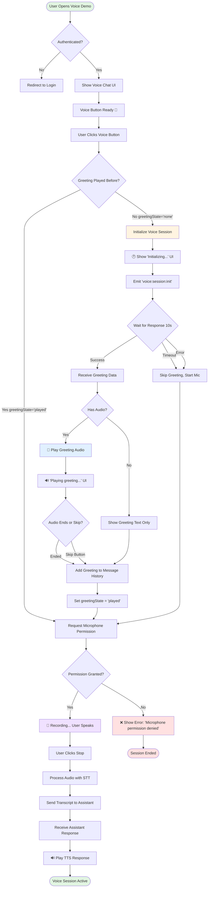
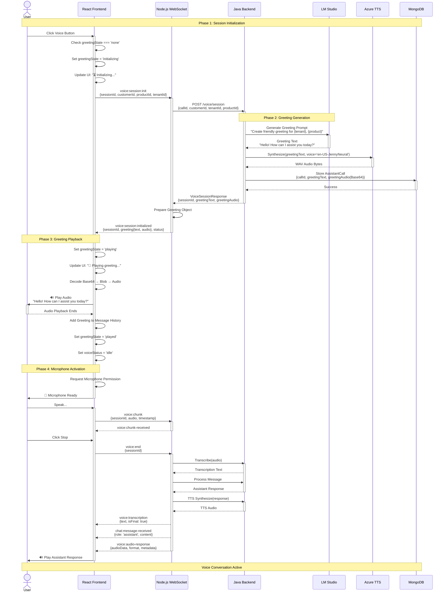
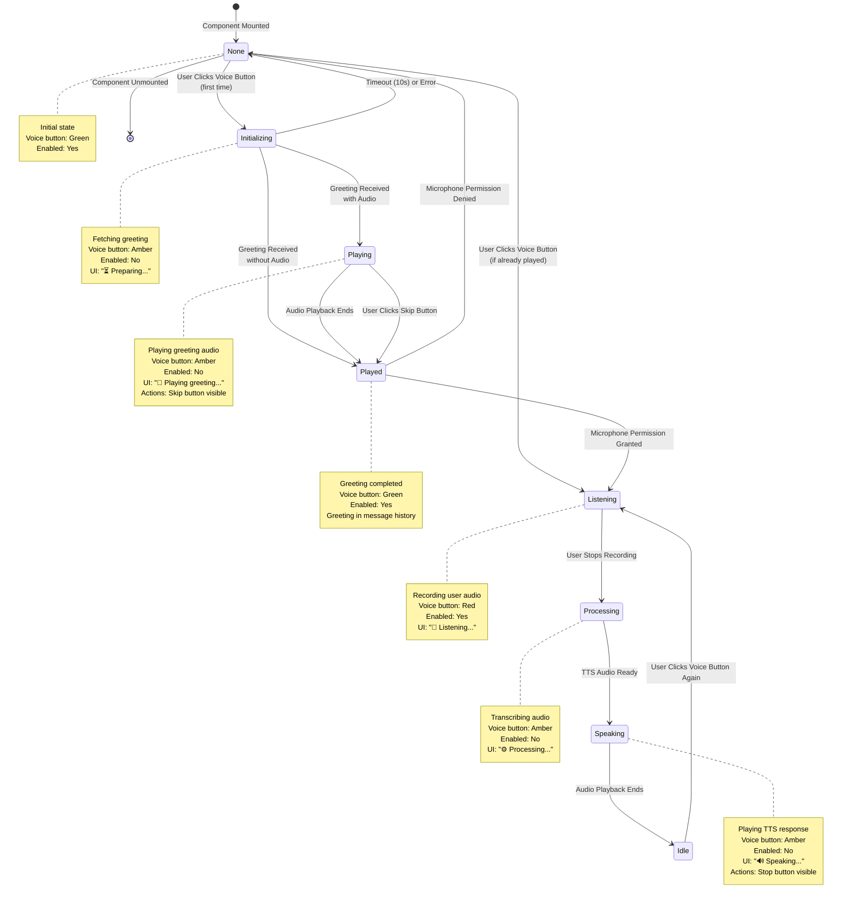
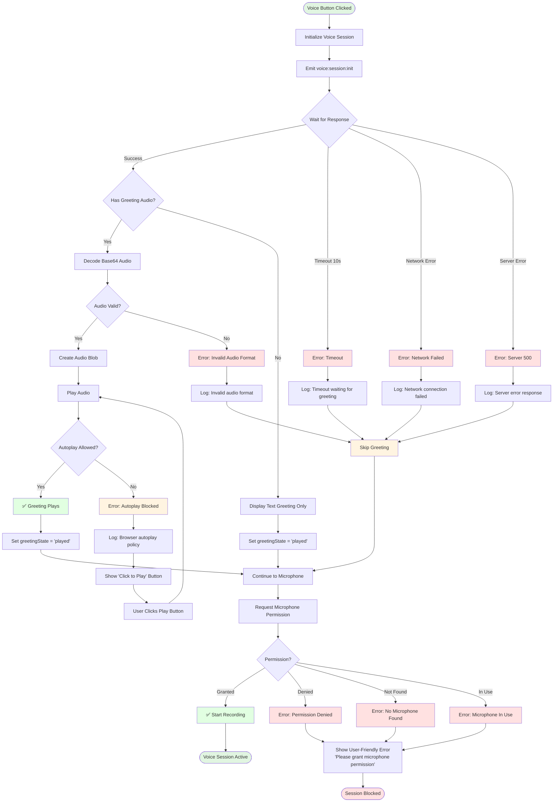
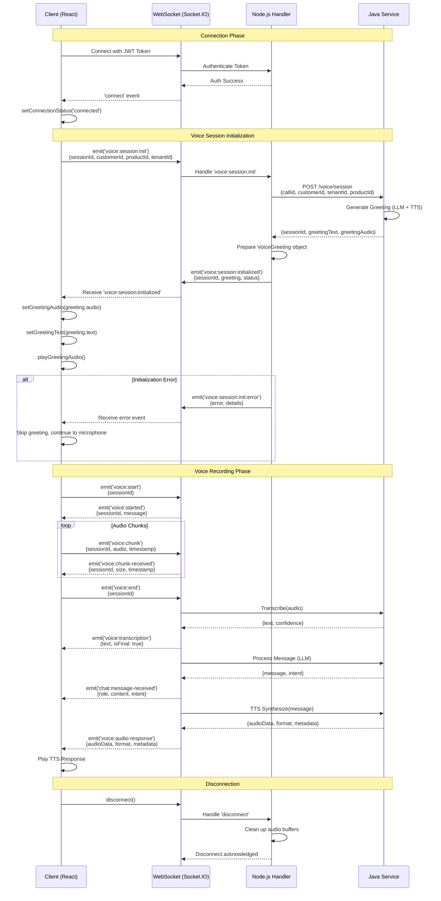
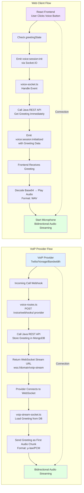

# Voice Greeting Workflow Diagrams

This document contains visual workflow diagrams for the voice greeting system implementation.

## Table of Contents
1. [Frontend User Workflow](#frontend-user-workflow)
2. [System Sequence Diagram](#system-sequence-diagram)
3. [State Machine Diagram](#state-machine-diagram)
4. [Component Interaction](#component-interaction)
5. [Error Handling Flow](#error-handling-flow)

---

## Frontend User Workflow

### Voice Session Initialization Flow



---

## System Sequence Diagram

### Complete Voice Greeting Sequence



---

## State Machine Diagram

### Greeting State Transitions



---

## Component Interaction

### Frontend Component Architecture

```mermaid
graph TB
    subgraph "React Frontend"
        VoiceDemo[VoiceDemo Page]
        AssistantChat[AssistantChat Component]
        VoiceButton[Voice Button]
        StatusIndicator[Voice Status Indicator]
        MessageHistory[Message History]
        AudioPlayer[Audio Player Ref]
        GreetingAudio[Greeting Audio Ref]
        
        VoiceDemo --> AssistantChat
        AssistantChat --> VoiceButton
        AssistantChat --> StatusIndicator
        AssistantChat --> MessageHistory
        AssistantChat --> AudioPlayer
        AssistantChat --> GreetingAudio
    end
    
    subgraph "State Management"
        SessionState[sessionId: string]
        GreetingState[greetingState: none|initializing|playing|played]
        VoiceStatus[voiceStatus: idle|listening|processing|speaking]
        GreetingData[greetingAudio: string<br/>greetingText: string]
        Messages[messages: Message[]]
        
        AssistantChat --> SessionState
        AssistantChat --> GreetingState
        AssistantChat --> VoiceStatus
        AssistantChat --> GreetingData
        AssistantChat --> Messages
    end
    
    subgraph "Socket.IO Client"
        SocketHook[useSocket Hook]
        SocketConnection[Socket Instance]
        
        AssistantChat --> SocketHook
        SocketHook --> SocketConnection
    end
    
    subgraph "Audio Processing"
        MediaRecorder[MediaRecorder API]
        AudioContext[Audio Context]
        Base64Decoder[Base64 Decoder]
        BlobCreator[Blob Creator]
        URLCreator[URL.createObjectURL]
        
        AssistantChat --> MediaRecorder
        AssistantChat --> AudioContext
        AssistantChat --> Base64Decoder
        Base64Decoder --> BlobCreator
        BlobCreator --> URLCreator
        URLCreator --> GreetingAudio
    end
    
    subgraph "Functions"
        InitVoice[initializeVoiceSession]
        PlayGreeting[playGreetingAudio]
        StartRecord[startVoiceRecording]
        StopRecord[stopVoiceRecording]
        ToggleRecord[toggleVoiceRecording]
        
        VoiceButton --> ToggleRecord
        ToggleRecord --> StartRecord
        ToggleRecord --> StopRecord
        StartRecord --> InitVoice
        InitVoice --> PlayGreeting
        PlayGreeting --> GreetingAudio
    end
    
    SocketConnection -->|voice:session:init| Backend[Node.js Backend]
    Backend -->|voice:session:initialized| SocketConnection
    
    style AssistantChat fill:#e1f0ff
    style GreetingState fill:#fff4e1
    style PlayGreeting fill:#e1ffe1
```

---

## Error Handling Flow

### Error Recovery Workflow



---

## WebSocket Event Flow

### Socket.IO Event Sequence



---

## UI State Transitions

### Visual State Changes

```mermaid
graph LR
    subgraph "Voice Button States"
        GreenMic[🎤 Green<br/>Ready to Record]
        AmberClock[🕐 Amber<br/>Initializing]
        AmberWave[👋 Amber<br/>Playing Greeting]
        RedStop[⏹️ Red<br/>Recording]
    end
    
    subgraph "Status Banner States"
        None1[No Banner]
        Initializing[⏳ Preparing voice assistant...<br/>Generating personalized greeting]
        PlayingGreeting[👋 Playing greeting...<br/>[Skip Button]]
        Listening[🎤 Listening...<br/>Click the microphone to stop]
        Processing[⚙️ Processing speech...]
        Speaking[🔊 Assistant is speaking...<br/>[Stop Button]]
    end
    
    GreenMic -->|Click| AmberClock
    AmberClock -->|Greeting Ready| AmberWave
    AmberWave -->|Audio Ends| GreenMic
    GreenMic -->|Start Recording| RedStop
    RedStop -->|Stop| GreenMic
    
    None1 -->|Initialize| Initializing
    Initializing -->|Greeting Ready| PlayingGreeting
    PlayingGreeting -->|Audio Ends| None1
    None1 -->|Start Recording| Listening
    Listening -->|Stop Recording| Processing
    Processing -->|Response Ready| Speaking
    Speaking -->|Audio Ends| None1
    
    style GreenMic fill:#10b981
    style RedStop fill:#ef4444
    style AmberClock fill:#f59e0b
    style AmberWave fill:#f59e0b
    style None1 fill:#f3f4f6
    style Initializing fill:#fef3c7
    style PlayingGreeting fill:#d1fae5
    style Listening fill:#dbeafe
    style Processing fill:#fef3c7
    style Speaking fill:#d1fae5
```

---

## Comparison: VoIP vs Web Client Workflows

### Side-by-Side Comparison



### Key Differences

| Aspect | VoIP Provider | Web Client |
|--------|---------------|------------|
| **Trigger** | Incoming phone call | User clicks voice button |
| **Authentication** | None (webhook validates signature) | JWT token required |
| **Namespace** | `/voip-stream` (separate) | Main namespace with auth |
| **Greeting Storage** | MongoDB (loaded on WebSocket connect) | Sent directly in Socket.IO event |
| **Audio Format** | Provider-specific (μ-law 8kHz for Twilio, PCM 16kHz for Vonage) | WAV 24kHz (browser-compatible) |
| **Greeting Delivery** | First audio chunk in stream (sendGreeting() function) | Base64 in event payload (playGreetingAudio() function) |
| **Session Lifecycle** | Provider manages call state | Frontend manages recording state |
| **Error Handling** | Call proceeds without greeting | Skip greeting, show UI message |

---

## Performance Metrics

### Expected Timings

```mermaid
gantt
    title Voice Greeting Initialization Timeline
    dateFormat X
    axisFormat %Ls
    
    section User Action
    User Clicks Button            :milestone, 0, 0
    
    section Frontend
    Emit voice:session:init       :a1, 0, 50
    Wait for response             :a2, 50, 10000
    Receive greeting data         :milestone, 2500, 0
    Decode Base64                 :a3, 2500, 100
    Create Blob                   :a4, 2600, 50
    Start audio playback          :milestone, 2650, 0
    Play greeting (2s audio)      :a5, 2650, 2000
    Add to message history        :a6, 4650, 50
    Request microphone            :a7, 4700, 200
    Microphone ready              :milestone, 4900, 0
    
    section Backend
    Receive init event            :b1, 50, 50
    Call Java REST API            :b2, 100, 2000
    Prepare response              :b3, 2100, 50
    Emit initialized event        :b4, 2150, 50
    
    section Java Service
    Receive REST request          :c1, 100, 50
    Call LLM                      :c2, 150, 1500
    Call TTS                      :c3, 1650, 300
    Store in MongoDB              :c4, 1950, 100
    Return response               :c5, 2050, 50
    
    section Total Time
    End-to-End Latency            :crit, 0, 4900
```

**Target Performance:**
- **Greeting Generation:** 1.5-2.5 seconds (LLM + TTS)
- **Network Round Trip:** 100-200ms
- **Audio Playback:** 2-3 seconds (greeting length)
- **Microphone Activation:** 100-200ms
- **Total Time to Recording:** ~5 seconds

---

## Revision History

| Version | Date | Author | Changes |
|---------|------|--------|---------|
| 1.0 | 2025-01-28 | AI Services Team | Initial workflow diagrams for Phase 3 |

---

## Related Documents

- [Voice Greeting Implementation Guide](../VOICE_GREETING_IMPLEMENTATION.md)
- [VoIP Voice Sessions](../VOIP_VOICE_SESSIONS.md)
- [Platform Architecture](../Platform%20Architecture%20Diagram.ini)

